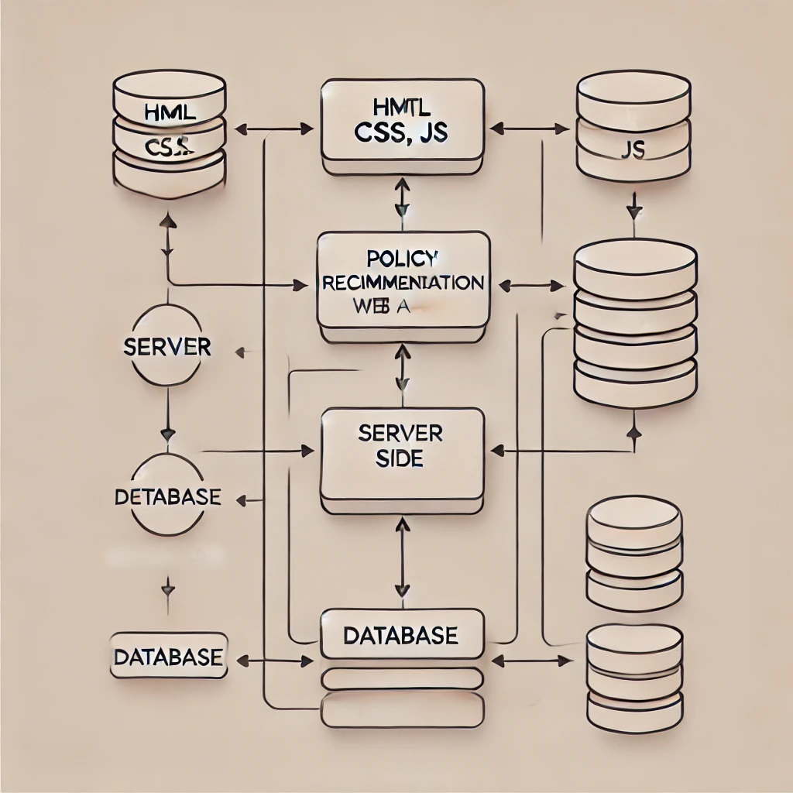

# [*서비스명]

### 해당 서비스는 2024 경주 지역문제 해결 해커톤 [**팀명]의 프로젝트 입니다.

---
## 서비스 소개(예시)
### [*서비스명]
- [*서비스명]은 사전 워크숍 참가자에게 메일을 전송하는 서비스 입니다.
- 엑셀 파일을 기반으로 편하게 메일을 전송해보세요.

---
## 기능(예시)

- 프론트엔드를 이용하여 참가자 이름, 메일, 전화번호를 입력
- 엑셀 파일을 조회하여 해당 참가자가 존재하는지, 메일과 전화번호가 일치하는지 확인
- 참가자에게 환영 및 안내 이메일을 전송

---
## 서비스 아키텍처(예시)

---
## 사용 기술(예시)
| **Category**         | **Technologies** |
|----------------------|-------------|
| **Frontend**         | html        |
| **Backend**          | flask, excel |
| **devops**           | localhost   |
| **Others**           | Github, Notion, Figma |

---
## 팀원 소개
| **팀원 이름**            | **팀원 이름** | **팀원 이름** | **팀원 이름** |
|----------------------|----------|-----------|---------|
| 팀장(Leader), Frontend | Frontend | Backend, devops | Backend |