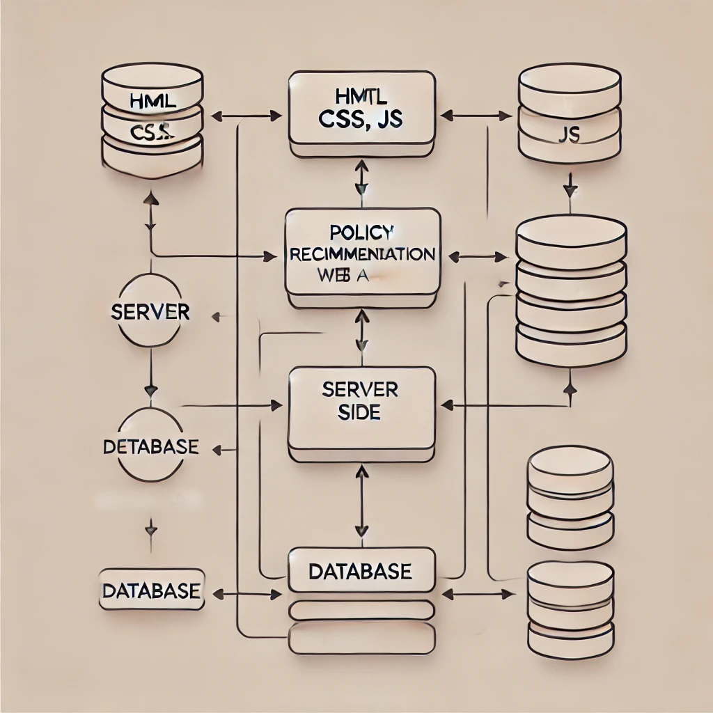

# [OPEN WAY]

### 해당 서비스는 2024 경주 지역문제 해결 해커톤 [요즘것들]의 프로젝트 입니다.
[OPEN WAY]는 창업을 하고자 하는 사람들을 위해서 걸맞는 AI를 기반한 정책을 추천해주고, 청년들의 비용 부담을 줄이기 위해서 gps를 활용한 빈점포를 공유오피스처럼 이용할 수 있는 서비스이다.

---
## 기능(예시)

홈 화면에서 AI를 기반한 정책의 버튼을 누르면, 사람들이 궁금해하는 정책을 AI가 말해준다.
사용자가 그 정책들중에 마음에 드는 정책이 있어 클릭하게 되면, 그 정책에 관한 링크로 이동한다.
gps를 기반한 map을 통해 이용자는 빈점포들을 볼 수 있고, 창업하고 싶은 지역이 있어 검색을 하면, 주변에 있는 점포의 정보가 나오고, 그 점포가 마음에 들면, 예약하는 기능을 넣었다.
예약하는 기능을 모두 수행하면, 메인화면에 있는 캘린더에 자동으로 입력된다.

---
## 서비스 아키텍처(예시)

---
## 사용 기술(예시)
| **Category**         | **Technologies** |
|----------------------|-------------|
| **Frontend**         | html, css, js      |
| **Backend**          |             |
| **devops**           | localhost:3000   |
| **Others**           | Github      |

---
## 팀원 소개
| **팀원 이름**            | **요즘것들** | **팀원 이름** | **팀원 이름** |
|----------------------|----------|-----------|---------|
| 팀장(Leader), Frontend | Frontend | Backend, devops | Backend |
